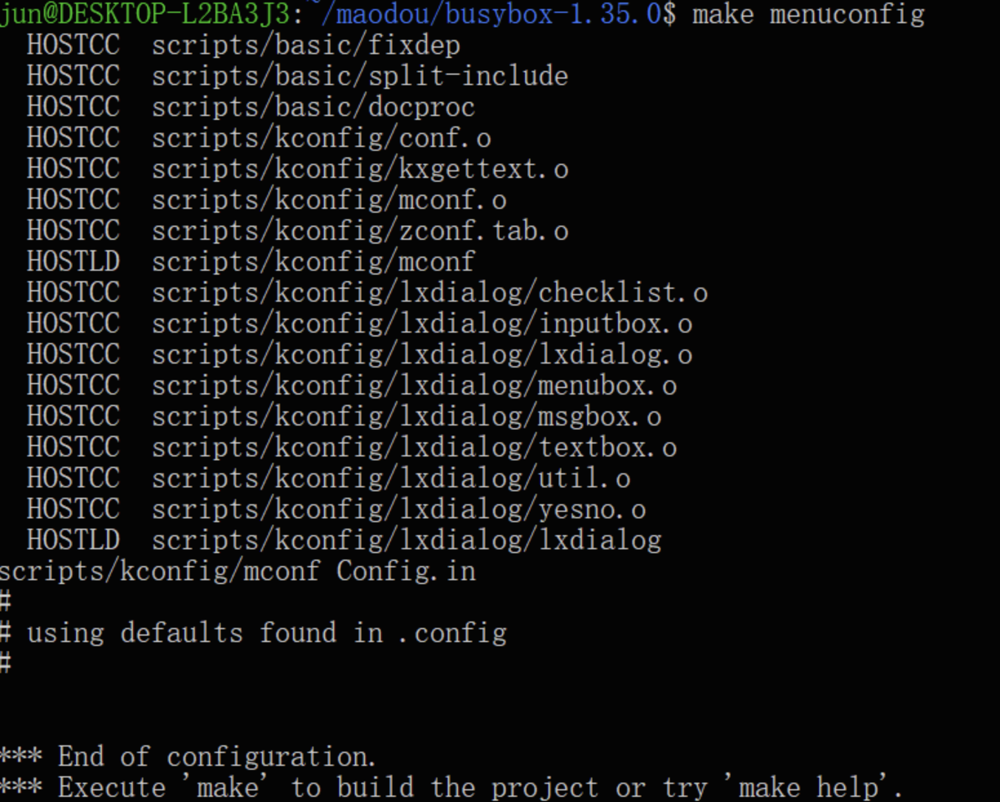
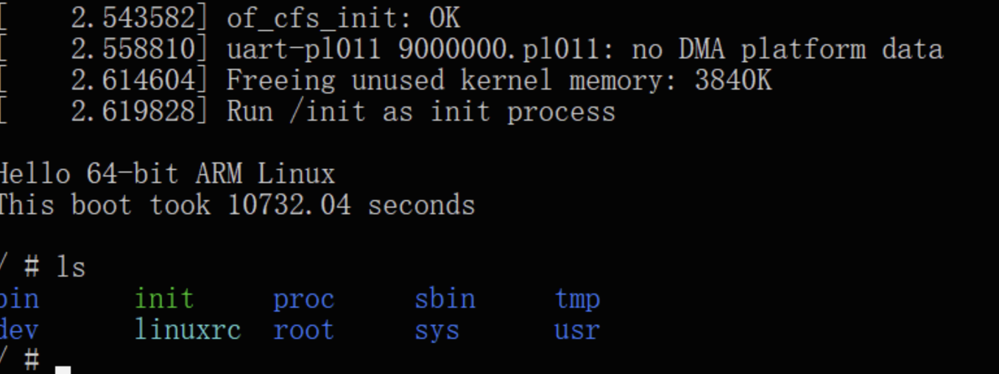

# 任务二：Linux 6.1 在 Qemu for x86/AArch64 中运行

**Qemu 模拟器硬件支持**

Qemu 模拟器支持的 virt machine 包含的模拟硬件(串口模拟用 One PL011 UART)
<https://www.qemu.org/docs/master/system/arm/virt.html>

Qemu 模拟器支持的 raspi3b machine 包含的模拟硬件
<https://www.qemu.org/docs/master/system/arm/raspi.html>
<https://www.qemu.org/docs/master/system/arm/raspi.html#implemented-devices>

树莓派 3B+的串口使用(有两个内建串口，一个是 PL011 Uart，一个是 Mini Uart)
<https://zhuanlan.zhihu.com/p/497002318>

使用 busybox 制作内存文件系统 initramfs：

1.  下载解压 busybox 并配置环境变量

    ```shell
    wget https://busybox.net/downloads/busybox-1.35.0.tar.bz2
    tar -xf busybox-1.35.0.tar.bz2
    cd busybox-1.35.0
    # 配置环境变量
    export ARCH=arm64
    export CROSS_COMPILE=aarch64-linux-gnu-
    ```

2.  配置编译内核的参数

    ```shell
    # busybox-1.35.0目录下
    make menuconfig
    # 修改配置，选中如下项目，静态编译
    # Settings -> Build Options -> [*] Build static binary (no share libs)

    # 反选如下项目，否则后续qemu执行会提示 /bin/sh:can't access tty;job control turned off
    # Shells -> [] Job control
    ```

    保存退出后，终端显示

    

3.  编译

    ```shell
    make -j `nproc`
    ```

    编译结束后出现如下提示可以忽略

    ```
    Trying libraries: m resolv rt
    Library m is needed, can't exclude it (yet)
    Library resolv is needed, can't exclude it (yet)
    Library rt is not needed, excluding it
    Library m is needed, can't exclude it (yet)
    Library resolv is needed, can't exclude it (yet)
    Final link with: m resolv
    ```

4.  安装

    安装前 busybox-1.35.0 目录下的文件如下图所示

    

    输入如下命令

    ```shell
    make install
    ```

    编译后 busybox-1.35.0 目录下的文件如下图所示

    

    安装后目录下生成了\_install 目录

5.  在\_install 目录下创建后续所需的文件和目录

    ```shell
    cd _install
    mkdir proc sys dev tmp
    touch init
    chmod +x init
    ```

6.  用任意的文本编辑器编辑 init 文件内容如下

    ```shell
    #!/bin/sh

    # 挂载一些必要的文件系统
    mount -t proc none /proc
    mount -t sysfs none /sys
    mount -t tmpfs none /tmp
    mount -t devtmpfs none /dev

    echo
    echo "Hello 64-bit ARM Linux"

    # 显示开机消耗时间
    echo "This boot took $(cut -d' ' -f1 /proc/uptime) seconds"
    echo

    # 停留在控制台
    exec /bin/sh
    ```

7.  用 busybox 制作 initramfs 文件

    ```shell
    # _install目录
    find . -print0 | cpio --null -ov --format=newc | gzip -9 > ../initramfs.cpio.gz
    ```

    执行成功后可在 busybox-1.35.0 目录下找到 initramfs.cpio.gz 文件

8.  进入 qemu 目录下，执行如下命令

    ```shell
    qemu-system-aarch64 -M virt -cpu cortex-a72 -smp 8 -m 128M -kernel (your Image path) -initrd (your initramfs.cpio.gz path) -nographic -append "init=/init console=ttyAMA0"
    ```

    其中`(your Image path)`为上一个任务中最后的`Image`镜像文件所在的目录，`(your initramfs.cpio.gz)`为步骤 7 中执行成功后得到的 initramfs.cpio.gz 的目录，例如

    ```shell
    qemu-system-aarch64 -M virt -cpu cortex-a72 -smp 8 -m 128M -kernel /home/jun/maodou/linux/arch/arm64/boot/Image -initrd /home/jun/maodou/busybox-1.35.0/initramfs.cpio.gz -nographic -append "init=/init console=ttyAMA0"
    ```

    可使用相对路径

    其中，qemu 启动参数的意义如下：

    ```shell
    -M：指定模拟的开发板，可通过qemu-system-aarch64 M help查看
    -cpu：指定模拟的cpu，可通过qemu-system-aarch64 -M virt --cpu help查看，这里选择cortex-a72。
    -smp：指定cpu核数量，启动后可以使用nproc命令核对。
    -m：指定内存大小，virt 可支持超大内存，启动后可以使用free -h命令核对。
    -kernel：指定启动的内核镜像；
    -initrd：指定启动的内存文件系统；
    -append：传递给内核的启动参数；启动后可使用cat /proc/cmdline命令核对。
    -nographic：启动字符界面（不启动图形界面），输出重定向到宿主机命令行，与参数 console=ttyAMA0 组合使用
    ```

    运行结果如下所示

    ```shell
    [    0.000000] Booting Linux on physical CPU 0x0000000000 [0x410fd083]
    [    0.000000] Linux version 6.1.25-v8+ (jun@DESKTOP-L2BA3J3) (aarch64-linux-gnu-gcc (Ubuntu 11.3.0-1ubuntu1~22.04) 11.3.0, GNU ld (GNU Binutils for Ubuntu) 2.38) #3 SMP PREEMPT Thu Apr 27 02:28:49 CST 2023
    [    0.000000] Machine model: linux,dummy-virt
    [    0.000000] efi: UEFI not found.
    [    0.000000] Zone ranges:
    [    0.000000]   DMA      [mem 0x0000000040000000-0x0000000047ffffff]
    [    0.000000]   DMA32    empty
    [    0.000000]   Normal   empty
    [    0.000000] Movable zone start for each node
    [    0.000000] Early memory node ranges
    [    0.000000]   node   0: [mem 0x0000000040000000-0x0000000047ffffff]
    [    0.000000] Initmem setup node 0 [mem 0x0000000040000000-0x0000000047ffffff]
    [    0.000000] cma: Reserved 8 MiB at 0x0000000047400000
    [    0.000000] psci: probing for conduit method from DT.
    [    0.000000] psci: PSCIv0.2 detected in firmware.
    [    0.000000] psci: Using standard PSCI v0.2 function IDs
    [    0.000000] psci: Trusted OS migration not required
    [    0.000000] Number of cores (8) exceeds configured maximum of 4 - clipping
    [    0.000000] percpu: Embedded 28 pages/cpu s74152 r8192 d32344 u114688
    [    0.000000] Detected PIPT I-cache on CPU0
    [    0.000000] CPU features: detected: Spectre-v2
    [    0.000000] CPU features: detected: Spectre-v3a
    [    0.000000] CPU features: detected: Spectre-v4
    [    0.000000] CPU features: detected: Spectre-BHB
    [    0.000000] CPU features: kernel page table isolation forced ON by KASLR
    [    0.000000] CPU features: detected: Kernel page table isolation (KPTI)
    [    0.000000] CPU features: detected: ARM erratum 1742098
    [    0.000000] CPU features: detected: ARM errata 1165522, 1319367, or 1530923
    [    0.000000] alternatives: applying boot alternatives
    [    0.000000] Built 1 zonelists, mobility grouping on.  Total pages: 32256
    [    0.000000] Kernel command line: init=/init console=ttyAMA0
    [    0.000000] Dentry cache hash table entries: 16384 (order: 5, 131072 bytes, linear)
    [    0.000000] Inode-cache hash table entries: 8192 (order: 4, 65536 bytes, linear)
    [    0.000000] mem auto-init: stack:off, heap alloc:off, heap free:off
    [    0.000000] Memory: 96388K/131072K available (11008K kernel code, 1978K rwdata, 3336K rodata, 3840K init, 1000K bss, 26492K reserved, 8192K cma-reserved)
    [    0.000000] SLUB: HWalign=64, Order=0-3, MinObjects=0, CPUs=4, Nodes=1
    [    0.000000] ftrace: allocating 35500 entries in 139 pages
    [    0.000000] ftrace: allocated 139 pages with 4 groups
    [    0.000000] trace event string verifier disabled
    [    0.000000] rcu: Preemptible hierarchical RCU implementation.
    [    0.000000] rcu:     RCU event tracing is enabled.
    [    0.000000]  Trampoline variant of Tasks RCU enabled.
    [    0.000000]  Rude variant of Tasks RCU enabled.
    [    0.000000]  Tracing variant of Tasks RCU enabled.
    [    0.000000] rcu: RCU calculated value of scheduler-enlistment delay is 100 jiffies.
    [    0.000000] NR_IRQS: 64, nr_irqs: 64, preallocated irqs: 0
    [    0.000000] Root IRQ handler: gic_handle_irq
    [    0.000000] rcu: srcu_init: Setting srcu_struct sizes based on contention.
    [    0.000000] arch_timer: cp15 timer(s) running at 62.50MHz (virt).
    [    0.000000] clocksource: arch_sys_counter: mask: 0x1ffffffffffffff max_cycles: 0x1cd42e208c, max_idle_ns: 881590405314 ns
    [    0.000091] sched_clock: 57 bits at 63MHz, resolution 16ns, wraps every 4398046511096ns
    [    0.012917] Console: colour dummy device 80x25
    [    0.014715] Calibrating delay loop (skipped), value calculated using timer frequency.. 125.00 BogoMIPS (lpj=62500)
    [    0.015162] pid_max: default: 32768 minimum: 301
    [    0.016408] LSM: Security Framework initializing
    [    0.022676] Mount-cache hash table entries: 512 (order: 0, 4096 bytes, linear)
    [    0.022759] Mountpoint-cache hash table entries: 512 (order: 0, 4096 bytes, linear)
    [    0.072277] cgroup: Disabling memory control group subsystem
    [    0.097326] CPU node for /cpus/cpu@4 exist but the possible cpu range is :0-3
    [    0.098235] CPU node for /cpus/cpu@5 exist but the possible cpu range is :0-3
    [    0.098604] CPU node for /cpus/cpu@6 exist but the possible cpu range is :0-3
    [    0.098910] CPU node for /cpus/cpu@7 exist but the possible cpu range is :0-3
    [    0.100953] cacheinfo: Unable to detect cache hierarchy for CPU 0
    [    0.111760] cblist_init_generic: Setting adjustable number of callback queues.
    [    0.111947] cblist_init_generic: Setting shift to 2 and lim to 1.
    [    0.112516] cblist_init_generic: Setting shift to 2 and lim to 1.
    [    0.113354] cblist_init_generic: Setting shift to 2 and lim to 1.
    [    0.115810] rcu: Hierarchical SRCU implementation.
    [    0.115866] rcu:     Max phase no-delay instances is 400.
    [    0.123961] EFI services will not be available.
    [    0.128069] smp: Bringing up secondary CPUs ...
    [    0.132605] Detected PIPT I-cache on CPU1
    [    0.133404] cacheinfo: Unable to detect cache hierarchy for CPU 1
    [    0.133823] CPU1: Booted secondary processor 0x0000000001 [0x410fd083]
    [    0.141740] Detected PIPT I-cache on CPU2
    [    0.142124] cacheinfo: Unable to detect cache hierarchy for CPU 2
    [    0.142532] CPU2: Booted secondary processor 0x0000000002 [0x410fd083]
    [    0.146704] Detected PIPT I-cache on CPU3
    [    0.146999] cacheinfo: Unable to detect cache hierarchy for CPU 3
    [    0.147248] CPU3: Booted secondary processor 0x0000000003 [0x410fd083]
    [    0.147948] smp: Brought up 1 node, 4 CPUs
    [    0.148001] SMP: Total of 4 processors activated.
    [    0.148167] CPU features: detected: 32-bit EL0 Support
    [    0.148277] CPU features: detected: CRC32 instructions
    [    0.152631] CPU: All CPU(s) started at EL1
    [    0.152688] alternatives: applying system-wide alternatives
    [    0.188730] devtmpfs: initialized
    [    0.208840] Enabled cp15_barrier support
    [    0.209365] Enabled setend support
    [    0.212216] clocksource: jiffies: mask: 0xffffffff max_cycles: 0xffffffff, max_idle_ns: 1911260446275000 ns
    [    0.212512] futex hash table entries: 1024 (order: 4, 65536 bytes, linear)
    [    0.218927] pinctrl core: initialized pinctrl subsystem
    [    0.236330] DMI not present or invalid.
    [    0.249155] NET: Registered PF_NETLINK/PF_ROUTE protocol family
    [    0.276325] DMA: preallocated 128 KiB GFP_KERNEL pool for atomic allocations
    [    0.279163] DMA: preallocated 128 KiB GFP_KERNEL|GFP_DMA pool for atomic allocations
    [    0.280715] DMA: preallocated 128 KiB GFP_KERNEL|GFP_DMA32 pool for atomic allocations
    [    0.281140] audit: initializing netlink subsys (disabled)
    [    0.285650] audit: type=2000 audit(0.222:1): state=initialized audit_enabled=0 res=1
    [    0.290581] thermal_sys: Registered thermal governor 'step_wise'
    [    0.291520] cpuidle: using governor menu
    [    0.293196] hw-breakpoint: found 6 breakpoint and 4 watchpoint registers.
    [    0.295702] ASID allocator initialised with 32768 entries
    [    0.297182] Serial: AMBA PL011 UART driver
    [    0.351451] 9000000.pl011: ttyAMA0 at MMIO 0x9000000 (irq = 13, base_baud = 0) is a PL011 rev1
    [    0.603658] printk: console [ttyAMA0] enabled
    [    0.620728] KASLR enabled
    [    0.712628] SCSI subsystem initialized
    [    0.716920] usbcore: registered new interface driver usbfs
    [    0.718003] usbcore: registered new interface driver hub
    [    0.718612] usbcore: registered new device driver usb
    [    0.721550] pps_core: LinuxPPS API ver. 1 registered
    [    0.721983] pps_core: Software ver. 5.3.6 - Copyright 2005-2007 Rodolfo Giometti <giometti@linux.it>
    [    0.724501] PTP clock support registered
    [    0.750721] clocksource: Switched to clocksource arch_sys_counter
    [    0.764408] VFS: Disk quotas dquot_6.6.0
    [    0.766205] VFS: Dquot-cache hash table entries: 512 (order 0, 4096 bytes)
    [    0.769411] FS-Cache: Loaded
    [    0.772236] CacheFiles: Loaded
    [    0.845061] NET: Registered PF_INET protocol family
    [    0.849606] IP idents hash table entries: 2048 (order: 2, 16384 bytes, linear)
    [    0.866793] tcp_listen_portaddr_hash hash table entries: 256 (order: 0, 4096 bytes, linear)
    [    0.868451] Table-perturb hash table entries: 65536 (order: 6, 262144 bytes, linear)
    [    0.869340] TCP established hash table entries: 1024 (order: 1, 8192 bytes, linear)
    [    0.871024] TCP bind hash table entries: 1024 (order: 3, 32768 bytes, linear)
    [    0.872885] TCP: Hash tables configured (established 1024 bind 1024)
    [    0.876938] UDP hash table entries: 256 (order: 1, 8192 bytes, linear)
    [    0.878683] UDP-Lite hash table entries: 256 (order: 1, 8192 bytes, linear)
    [    0.883045] NET: Registered PF_UNIX/PF_LOCAL protocol family
    [    0.895783] RPC: Registered named UNIX socket transport module.
    [    0.896190] RPC: Registered udp transport module.
    [    0.896414] RPC: Registered tcp transport module.
    [    0.897470] RPC: Registered tcp NFSv4.1 backchannel transport module.
    [    0.912912] hw perfevents: enabled with armv8_pmuv3 PMU driver, 5 counters available
    [    0.915441] Trying to unpack rootfs image as initramfs...
    [    1.179258] Freeing initrd memory: 1140K
    [    2.287308] Initialise system trusted keyrings
    [    2.297304] workingset: timestamp_bits=46 max_order=15 bucket_order=0
    [    2.324224] zbud: loaded
    [    2.341364] NFS: Registering the id_resolver key type
    [    2.343083] Key type id_resolver registered
    [    2.343402] Key type id_legacy registered
    [    2.345689] nfs4filelayout_init: NFSv4 File Layout Driver Registering...
    [    2.346213] nfs4flexfilelayout_init: NFSv4 Flexfile Layout Driver Registering...
    [    2.357375] Key type asymmetric registered
    [    2.358373] Asymmetric key parser 'x509' registered
    [    2.360307] Block layer SCSI generic (bsg) driver version 0.4 loaded (major 247)
    [    2.362114] io scheduler mq-deadline registered
    [    2.363186] io scheduler kyber registered
    [    2.421284] vc-mem: phys_addr:0x00000000 mem_base=0x00000000 mem_size:0x00000000(0 MiB)
    [    2.428120] cacheinfo: Unable to detect cache hierarchy for CPU 0
    [    2.503885] brd: module loaded
    [    2.547578] loop: module loaded
    [    2.553900] Loading iSCSI transport class v2.0-870.
    [    2.564699] usbcore: registered new interface driver lan78xx
    [    2.565208] usbcore: registered new interface driver smsc95xx
    [    2.566010] dwc_otg: version 3.00a 10-AUG-2012 (platform bus)
    [    2.570927] usbcore: registered new interface driver usb-storage
    [    2.579958] sdhci: Secure Digital Host Controller Interface driver
    [    2.580349] sdhci: Copyright(c) Pierre Ossman
    [    2.582803] sdhci-pltfm: SDHCI platform and OF driver helper
    [    2.586599] ledtrig-cpu: registered to indicate activity on CPUs
    [    2.589870] hid: raw HID events driver (C) Jiri Kosina
    [    2.591268] usbcore: registered new interface driver usbhid
    [    2.591876] usbhid: USB HID core driver
    [    2.597777] Initializing XFRM netlink socket
    [    2.598860] NET: Registered PF_PACKET protocol family
    [    2.600248] Key type dns_resolver registered
    [    2.606225] registered taskstats version 1
    [    2.606980] Loading compiled-in X.509 certificates
    [    2.616060] Key type .fscrypt registered
    [    2.616320] Key type fscrypt-provisioning registered
    [    2.728236] of_cfs_init
    [    2.738597] of_cfs_init: OK
    [    2.765467] uart-pl011 9000000.pl011: no DMA platform data
    [    2.837268] Freeing unused kernel memory: 3840K
    [    2.843935] Run /init as init process

    Hello 64-bit ARM Linux
    This boot took 10732.04 seconds

    / #
    ```

9.  在启动的 linux 内核中的终端输入`ls`命令查看当前目录下文件列表，如下图所示

    

    可以看到文件列表与\_install 目录下的文件保持一致

参考资料：[QEMU 启动 ARM64 Linux 内核*linux 启动 qemu*许振坪的博客-CSDN 博客](https://blog.csdn.net/benkaoya/article/details/129509269)
